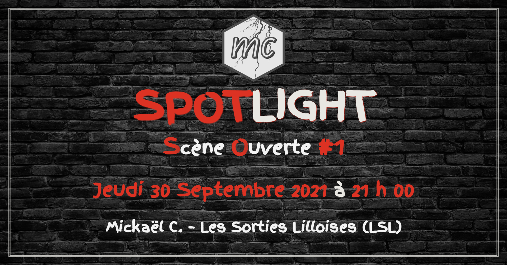

<!-- README.md is generated from README.Rmd. Please edit that file -->

# Spotlight Night Poster

<!-- badges: start -->

<!-- badges: end -->

<table width="100%%">
<tr>
<td align="center">
<a href="posters"> 2021-09-30</a>
</td>
<td align="center">
<a href="posters"> 2022-03-03</a>
</td>
</tr>
</table>
