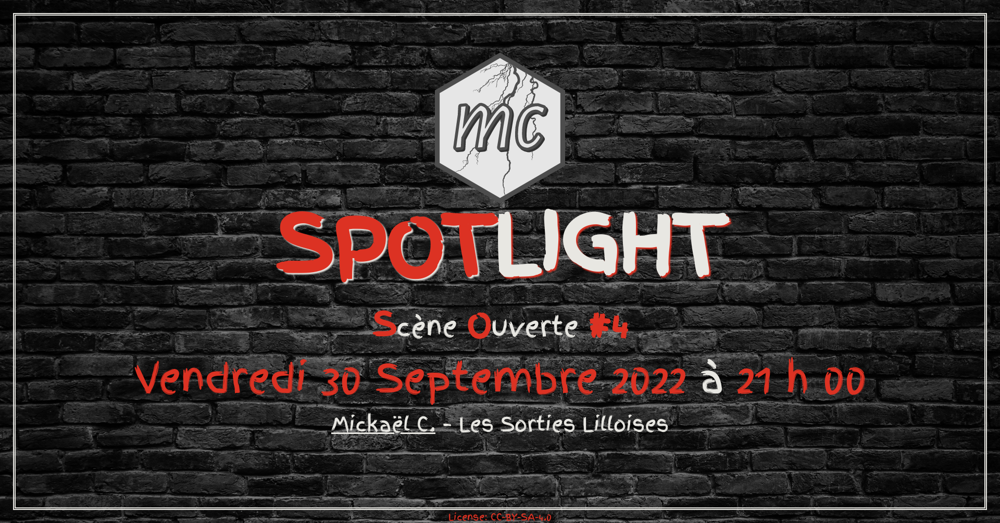
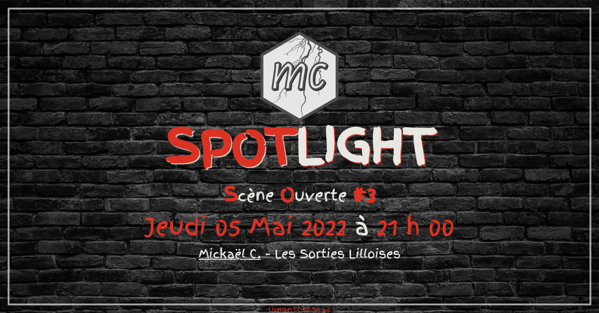
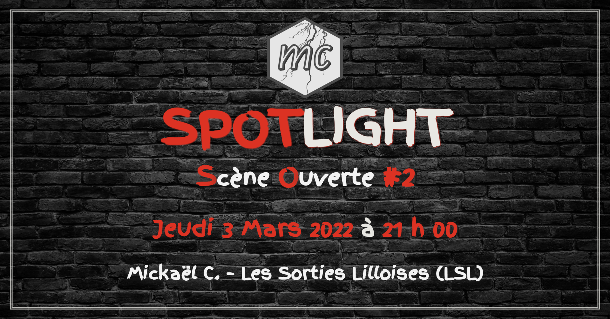

Spotlight Night Poster

================

<!-- badges: start -->

<!-- badges: end -->

## \[Humour\] SpotLight - Scène Ouverte \#4 (MC)

    L'obtention et/ou la réservation d'une place sur place ou en ligne (6€) est à la charge du participant ou de la participante.
    Aucune réservation de groupe ne sera faite puisque le Spotlight n'en prend pas.
    De ce fait, il est conseillé de venir 10/15 (voire 30 minutes) avant le début de la "Scène Ouverte".

    A toutes fins utiles, si vous indiquez "participe", c'est que vous venez, sinon il y a "peut-être". 😉

    ----------------------------------------

    "La scène ouverte du Spotlight a très vite bénéficié d'une réputation telle qu'elle est devenue le rendez-vous incontournable de l'humour à Lille.
    Les demandes d'artistes qui veulent fouler cette scène affluent de partout en France, mais pas que !

    Chaque artiste peut se confronter à la réalité d’un public et tester ses sketchs et/ou des extraits de son One man.

    Car, qu’on ne s’y trompe pas, il ne s’agit pas d’un spectacle mais d'un laboratoire indispensable pour se réaliser, bien plus efficace que le miroir d’une salle de bain car c’est le public qui en est le témoin interactif par les silences, les rires et les applaudissements.

    Venez découvrir et encourager ces nouveaux talents du rire !"

    Source : https://www.spotlight-lille.com/

    ----------------------------------------

    Contenu/Images sous licence CC-BY-SA-4.0

Voir toutes les affiches.

## \[Jeux\] Game Night \#4 (MC)

<table>
<tr>
<td>

</td>
<td>

</td>
<td>

</td>
<td>

</td>
</tr>
<tr>
<td>

</td>
<td>

</td>
<td>

</td>
<td>

</td>
</tr>
</table>

